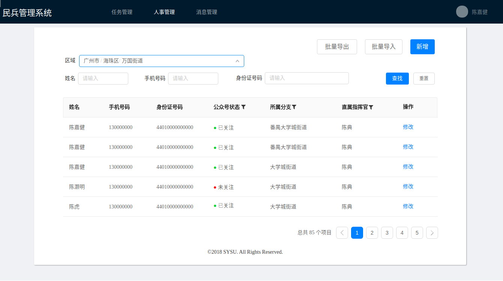

# 人事管理（批量管理）

## 接口定义

### 批量导入

- 请求：
    - URL: /pm-batch/upload
    - Method: POST
    - Header: Content-Type: multipart/form-data
    - Body:（文件）

- 响应：
    ```js
    {
        "code": 200,        // http状态码
        "enmsg": "ok",      // 报错string常量 
        "cnmsg": "导入成功", // 报错信息
        "data": null        // 数据，本接口没有数据
    }
    ```
- 示例表格文件：
    - 下载地址：[model.xlsx](https://github.com/MBControlGroup/MBCG-BE-PM-Batch/raw/master/model.xlsx)
    - 字段依次为：
        1. 姓名
        2. 手机号码
        3. 身份证号码
        4. 所属市
        5. 所属区
        6. 所属街道
        7. 直属指挥官姓名

- curl示例：

    ```bash
    curl -X POST http://localhost:9600/upload \
        -F "upload_batch=@/home/xujijun/soldiers.xlsx" \
        -H "Content-Type: multipart/form-data"
    ```

- HTML示例：

    ```html
    <html>
        <title>upload example</title>

        <body>

            <form action="http://www.mbcs.com/pm-batch/upload" method="post" enctype="multipart/form-data">
                <label for="file">Filename:</label>
                <input type="file" name="upload_batch" id="uploadFile">
                <input type="submit" name="submit" value="Submit">
            </form>

        </body>
    </html>
    ```

- 备注：**目前仅支持导入xlsx文件！**


### 批量导出

- 请求：
    - URL: /pm-batch/download
    - Method: GET
    - Header: Content-Type: multipart/form-data

- 响应：
    - 下载的文件

## 项目说明

### 技术选型

- 语言：Golang 1.10.1
- 数据库：MySQL 5.7.22
- Web框架：Gin
- ORM库：gorm
- 部署工具：docker + rancher

### 架构说明

- vendor：各项依赖
    - controllers：控制器，主要业务逻辑所在
    - dao：直接与数据库交互的逻辑
    - models：数据对象模板
    - protocol：与客户端的通信协议（HTTP之上，使用JSON封装）
    - routes：路由逻辑
    - 第三方依赖
- main.go：主函数入口，关联路径和routes中的模块

### 前端效果

